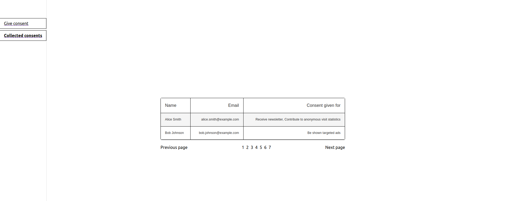

# Didomi Entry Task

Features React Frontend and NodeJS server as Backend. Task is built on Node v20.0.0.

# Setup

In server directory, rename sample.env to env.

1. Server Setup

```bash
cd server
npm install
npx ts-node src/server.ts
```

2. Frontend Setup

```bash
cd frontend
npm install
npm start
```

# Tests (Rendering tests & Logical tests incluided)

In order to run frontend tests, run:

```bash
npm test
```

# Screenshots

Initial Screen


Once user input is valid


Consents Table


Another screenshot of Consents Table

